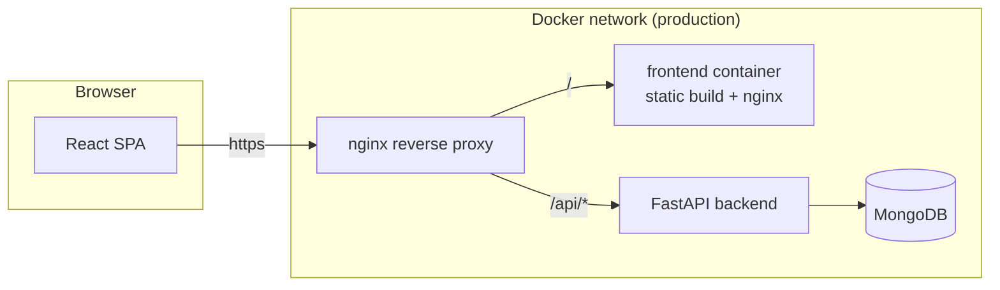
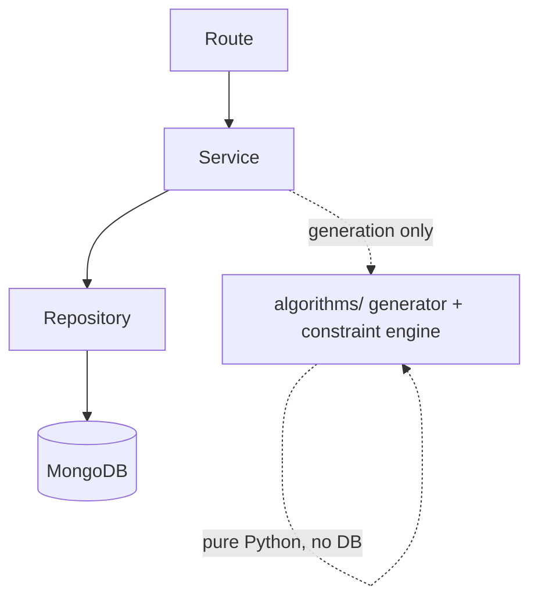

# Smart Department Timetable Management System

A production-oriented college department timetable management system: department/faculty/curriculum administration, role-based access control, and an OR-Tools constraint-solver timetable generation engine with manual editing, versioning, and a publish/rollback workflow.

> **Status: core platform, not yet feature-complete.** This README describes what is actually implemented and working today, and lists what is explicitly deferred. Nothing below claims more than what exists in the codebase - see [What's not built yet](#whats-not-built-yet) before you plan around this.

---

## Table of contents

- [Features](#features)
- [What's not built yet](#whats-not-built-yet)
- [Architecture](#architecture)
- [Technology stack](#technology-stack)
- [Two notable deviations from a typical spec](#two-notable-deviations-from-a-typical-spec)
- [Getting started](#getting-started)
  - [Option A: Docker Compose (recommended)](#option-a-docker-compose-recommended)
  - [Option B: run it locally without Docker](#option-b-run-it-locally-without-docker)
- [Environment variables](#environment-variables)
- [Default login](#default-login)
- [User roles](#user-roles)
- [The timetable generation engine](#the-timetable-generation-engine)
- [API overview](#api-overview)
- [Project structure](#project-structure)
- [Testing](#testing)
- [Production deployment](#production-deployment)
- [Free-tier deployment (Netlify + Render + MongoDB Atlas)](#free-tier-deployment-netlify--render--mongodb-atlas)
- [Troubleshooting](#troubleshooting)

---

## Features

**Authentication & accounts**
JWT access tokens (short-lived, in-memory on the frontend) + httpOnly-cookie refresh tokens with rotation and per-device session revocation. Role-based access control across four roles (Super Admin, HOD, Faculty, Student).

**Master data management** (full CRUD, search, sort, pagination, soft-delete + restore, audit trail on every record)
Departments, Users, Faculty, Courses, Subjects, Sections, Rooms, Laboratories, Academic Years, Semesters, Time Slots, Subject Allocations (faculty↔subject↔section assignment).

**Timetable generation engine**
A real Google OR-Tools CP-SAT constraint solver - not a heuristic or a stub. Enforces 8 hard constraints (faculty/room double-booking, weekly hour caps, faculty unavailability, required subject hours, room type matching, room capacity, active-resource-only) and optimizes 4 soft constraints (preferred slots, same-day repetition, gap minimization, workload balancing) via a weighted objective. Cross-section aware - generating one section's timetable respects faculty/room commitments already made in other sections' timetables that term.

**Conflict detection, manual editing, versioning**
Every hard constraint is independently re-checkable against any concrete schedule (not just at generation time), which is what powers `POST /timetable/validate` and the manual editor (move/swap/replace faculty/replace room/add/delete, each rejected if it would create a conflict). Publishing creates a new version and archives the previous one; rollback restores an archived version.

## What's not built yet

Explicitly deferred, not silently skipped:

- Dashboard analytics beyond the basic stat cards + one chart (faculty workload charts, room utilization charts, subject distribution, etc.)
- PDF export, Excel export, print mode
- Notifications (backend model + bell in the navbar) and email delivery
- Calendar (.ics) export
- AI-assisted optimization layer and the natural-language query assistant
- Global search, audit log viewer UI, Settings page, backup/restore tooling
- Frontend pages for the timetable module itself (generate/editor/conflict-viewer/workload/history screens) - the APIs exist and are tested; the UI to drive them does not yet
- CI/CD pipeline

## Architecture



Backend layering is strict: **routes** parse the request and format the response only; **services** hold all business logic and validation; **repositories** are the only layer that touches MongoDB; **algorithms/** (the timetable engine) has zero database dependency at all, so it's unit-testable without a running Mongo instance.



## Technology stack

| Layer | Choice | Notes |
|---|---|---|
| Frontend | React 19, Vite, Tailwind CSS v4, React Router v8, TanStack Query v5, React Hook Form + Zod v3, Recharts, Framer Motion, lucide-react | |
| Backend | FastAPI, Pydantic v2, **PyMongo Async**, JWT (**PyJWT**), **pwdlib** (Argon2), slowapi, Google OR-Tools (CP-SAT) | See [deviations](#two-notable-deviations-from-a-typical-spec) below |
| Database | MongoDB 8 | |
| Infra | Docker, Docker Compose (separate dev/prod files), Nginx | |

## Two notable deviations from a typical spec

Both researched and reasoned through, not guesses - each is called out again in code comments at the point of use:

1. **Motor → PyMongo's native Async API.** Motor was formally deprecated (EOL May 2026); MongoDB's own docs now direct Motor users to `pymongo.AsyncMongoClient`, which is a near drop-in replacement. See `backend/app/database/connection.py`.
2. **python-jose + passlib → PyJWT + pwdlib.** python-jose is unmaintained with an unpatched CVE; passlib is unmaintained and actively broken by bcrypt 5.0 and Python 3.13. FastAPI's own official docs made this exact same substitution. See `backend/app/auth/`.

## Getting started

### Option A: Docker Compose (recommended)

**Development** (hot-reload on both frontend and backend):

```bash
cp backend/.env.example backend/.env
# Edit backend/.env if you want, then:
docker compose up --build
```

- Frontend: http://localhost:5173
- Backend API: http://localhost:8000/api/v1 (interactive docs at `/docs`)
- MongoDB: localhost:27017

**Production** (built images behind the reverse-proxy nginx, nothing else exposed to the host):

```bash
cp .env.example .env
# Edit .env - at minimum set JWT_SECRET_KEY, SUPER_ADMIN_PASSWORD, CORS_ORIGINS
docker compose -f docker-compose.prod.yml up --build -d
```

- Everything: http://localhost (or your domain, once you point DNS/TLS at it)

### Option B: run it locally without Docker

**Backend:**

```bash
cd backend
python3 -m venv .venv && source .venv/bin/activate
pip install -r requirements.txt
cp .env.example .env
uvicorn app.main:app --reload
```

**Frontend** (separate terminal):

```bash
cd frontend
npm install
npm run dev
```

MongoDB must be running and reachable at whatever `MONGODB_URL` you set in `backend/.env` (defaults to `mongodb://localhost:27017`).

## Environment variables

See `backend/.env.example` (standalone local dev) and `.env.example` at the project root (Docker Compose production). Key ones:

| Variable | Purpose |
|---|---|
| `MONGODB_URL`, `MONGODB_DB_NAME` | Database connection |
| `JWT_SECRET_KEY` | **Must be changed before any real deployment** - generate with `python3 -c "import secrets; print(secrets.token_hex(32))"` |
| `ACCESS_TOKEN_EXPIRE_MINUTES`, `REFRESH_TOKEN_EXPIRE_DAYS` | Token lifetimes |
| `CORS_ORIGINS` | Comma-separated allowed origins |
| `SUPER_ADMIN_EMAIL`, `SUPER_ADMIN_PASSWORD` | Bootstrap account created once, on first startup, if no users exist yet |
| `RATE_LIMIT_LOGIN` | Login attempt throttling (e.g. `5/minute`) |

No secrets are committed to this repository - both `.env.example` files contain placeholders only.

## Default login

On first startup against an empty database, a Super Admin account is created automatically from `SUPER_ADMIN_EMAIL` / `SUPER_ADMIN_PASSWORD` (defaults: `admin@college.edu` / `Admin@123456`). **Change this password immediately after your first login** - it's logged as a warning on every startup until you do.

## User roles

| Role | Can do |
|---|---|
| **Super Admin** | Everything: all master data, all departments, generate/publish/rollback/delete any timetable |
| **HOD** | Manage their own department's faculty/courses/subjects/sections/labs/users; generate, manually edit, and publish their own department's timetables |
| **Faculty** | View their own profile and (once published) their own teaching schedule |
| **Student** | View their own section's published timetable |

## The timetable generation engine

Generation is scoped to one Section at a time. Before generating, a HOD must set up **Subject Allocations** (which faculty teaches which subject to which section) - this is a deliberate, separate administrative step from scheduling itself, matching how real institutions actually operate.

```
Subject Allocations (who teaches what)
        |
        v
Build SchedulingDemands (split each subject's lecture/lab hours into separate demands)
        |
        v
Build CP-SAT variables (eligibility-filtered: room type, capacity, faculty availability,
                          cross-section occupancy - so impossible combinations never even
                          become a decision variable)
        |
        v
Apply 8 hard constraints -> Add 4 soft-constraint objective terms -> Solve (bounded time limit)
        |
        v
Parse solution into entries -> Independently re-validate against every hard constraint
        |
        v
Save as DRAFT/GENERATED  (or FAILED, with a structured, actionable reason, if infeasible)
```

Every hard-constraint rule is one class in `backend/app/algorithms/constraints/hard_constraints.py`, implementing both a CP-SAT `.apply()` and a solver-independent `.check()`. `.check()` is pure Python with no OR-Tools dependency, which is what lets the exact same rules power the manual editor's validation and `POST /timetable/validate` without a second implementation to drift out of sync. See the module's docstring for the full reasoning, including why some "hard constraints" (room type matching, capacity, breaks, active-only) show up only in `.check()` - they're enforced structurally in the variable-builder instead of via an explicit solver constraint.

## API overview

Interactive docs at `/docs` (Swagger) once the backend is running. Base path: `/api/v1`.

| Prefix | Covers |
|---|---|
| `/auth` | Login, refresh, logout, self-service profile |
| `/users`, `/departments`, `/faculty`, `/courses`, `/subjects`, `/sections`, `/rooms`, `/labs`, `/academic-years`, `/semesters`, `/timeslots` | Master data CRUD (soft-delete + restore on every resource) |
| `/subject-allocations` | Faculty↔subject↔section assignment |
| `/timetable` | Generate, read, publish, rollback, history, manual edit operations, workload, room allocation |

Every list endpoint supports `page`, `limit`, `search`, `sort_by`, `sort_order`, and `include_inactive`. Every response uses the standard envelope: `{"success": bool, "message": str, "data": ..., "meta"?: {...}}`.

## Project structure

```
smart-timetable-system/
├── frontend/
│   └── src/
│       ├── components/{common,crud}/   # Reusable UI + the generic CRUD list/form components every entity page is built from
│       ├── layouts/                    # Sidebar, Topbar, DashboardLayout, AuthLayout
│       ├── pages/                      # One folder per screen
│       ├── hooks/                      # useCrudQueries (generic list/create/update/delete/restore), useAuth, useTheme, useDebounce
│       ├── services/api/               # Axios client (auto-refresh on 401) + per-entity API objects
│       ├── context/                    # Auth, Toast
│       └── routes/                     # Route tree + auth/role guards
│   └── netlify.toml                    # Netlify build config + the /api proxy rewrite (free-tier deployment)
├── backend/
│   └── app/
│       ├── auth/, config/, database/, core/, middleware/, utils/
│       ├── models/, schemas/           # Mongo document shape vs. API request/response contracts
│       ├── repositories/               # The only layer that touches MongoDB
│       ├── services/                   # All business logic and validation
│       ├── routes/                     # Thin - parse request, call service, format response
│       ├── algorithms/                 # The timetable engine - zero DB dependency
│       └── tests/
├── nginx/nginx.conf                    # Production reverse proxy (only used by docker-compose.prod.yml)
├── docker-compose.yml                  # Development (hot reload)
├── docker-compose.prod.yml             # Production (built images, nginx-fronted)
├── render.yaml                         # Render Blueprint for the backend (free-tier deployment)
└── .env.example
```


## Testing

Backend tests live in `backend/app/tests/` (pytest). Run with:

```bash
cd backend
pip install -r requirements-dev.txt
pytest
```

Covers: password hashing, JWT creation/verification, pagination math, time-slot helpers, and all 8 hard timetable constraints (double-booking, overload, unavailability, missing hours, room-type mismatch, capacity, inactive resources) exercised against synthetic data. The constraint tests are pure Python with no database or solver dependency, by design - see the architecture note above.

No frontend test suite exists yet - the frontend itself is new enough that adding tests before the UI settles would mean rewriting them immediately after.

## Production deployment

`docker-compose.prod.yml` builds real images and puts a single nginx reverse proxy in front of everything - the `frontend`, `backend`, and `mongo` containers are not exposed to the host directly. Before deploying:

1. Copy `.env.example` to `.env` and set real values - **especially** `JWT_SECRET_KEY`, `SUPER_ADMIN_PASSWORD`, and `CORS_ORIGINS`.
2. Put TLS termination in front of the nginx container (a managed load balancer, or add a cert to `nginx/nginx.conf` yourself) - it currently serves plain HTTP, which is fine behind a TLS-terminating proxy but not on its own for a public deployment.
3. `docker compose -f docker-compose.prod.yml up --build -d`

## Free-tier deployment (Netlify + Render + MongoDB Atlas)

A no-server-to-manage alternative to the Docker/VM path above, using each platform's permanently-free tier. `render.yaml` and `frontend/netlify.toml` in this repo are already configured for it - only account setup and a few pasted values are left to do.

**Why no code changes were needed for auth/CORS:** Netlify's `/api/*` redirect rule in `frontend/netlify.toml` proxies API calls to Render *from Netlify's own edge*, not from the browser. As far as the browser is concerned, it's talking to one origin the whole time, so the existing httpOnly refresh-token cookie (`SameSite=Lax`) and the frontend's relative `/api/v1` base URL both keep working unmodified. (This specific trick relies on Netlify's rewrite-to-external-origin support - Cloudflare Pages, for comparison, explicitly does not support proxying to an external domain, so this exact setup is Netlify-specific.)

1. **MongoDB Atlas**: create a free M0 cluster, add a database user, and under Network Access add `0.0.0.0/0` (Render's free tier has no static outbound IP to allowlist more narrowly - Atlas still requires the database username/password regardless). Copy the `mongodb+srv://...` connection string.
2. **Render**: New → Blueprint → point it at this repo. It reads `render.yaml` automatically. Fill in the values marked "you fill this in" in that file: `MONGODB_URL` (from step 1), `CORS_ORIGINS` (your Netlify URL, once you know it from step 3), `SUPER_ADMIN_EMAIL`/`SUPER_ADMIN_PASSWORD`. `JWT_SECRET_KEY` is generated for you automatically - you never need to create one. Note the resulting service URL.
3. **Netlify**: New site from Git → same repo → set **Base directory** to `frontend`. If your Render service isn't named `smart-timetable-backend`, update the URL in `frontend/netlify.toml`'s redirect rule to match before deploying.
4. Go back to Render and set `CORS_ORIGINS` to the Netlify URL from step 3, then redeploy the backend.

**Known limitation of this path**: Render's free web service gives roughly 0.1 CPU, far below what the CP-SAT solver assumes by default - `render.yaml` sets `SOLVER_NUM_SEARCH_WORKERS=1` accordingly, but expect timetable generation to be noticeably slower than on a real machine, and the service spins down after 15 minutes of inactivity (first request after that takes 30-60s to wake it back up).

## Troubleshooting

- **Login fails immediately after first startup** - check the backend logs for the bootstrap warning with the generated Super Admin email; make sure `SUPER_ADMIN_PASSWORD` in your `.env` is what you expect.
- **CORS errors in the browser console** - `CORS_ORIGINS` in your backend `.env` must exactly match the origin your browser is actually loading the frontend from (protocol + host + port).
- **Timetable generation returns `INFEASIBLE`** - the response includes a structured hint (total sessions needed vs. available slots/rooms). Common causes: not enough classrooms/labs of the right capacity, a faculty member's `unavailable_slots` leaving no valid time, or more weekly hours requested than the week has non-break periods for.
- **A dependency version seems off** - this project pins several packages to specific major versions deliberately (Zod v3, React Hook Form v7) rather than whatever is newest, because their newer major versions changed enough that hand-writing correct syntax for them without being able to run/verify locally was a real risk. See code comments where this matters.
